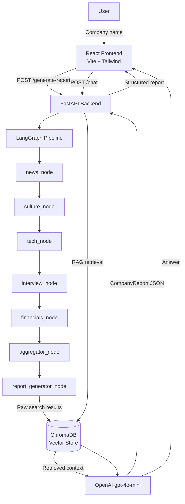

<div align="center">

# Company Research Assistant

**AI-powered pre-interview company briefing — research any company in under 60 seconds.**

[](https://python.org)
[](https://react.dev)
[](https://fastapi.tiangolo.com)
[](https://langchain.com)
[](https://langchain-ai.github.io/langgraph/)
[](https://opensource.org/licenses/MIT)

</div>

---

## Live Demo

| Service     | URL                                                      |
| ----------- | -------------------------------------------------------- |
| Frontend    | https://company-research-assistant-frontend.onrender.com |
| Backend API | https://company-research-assistant-j8om.onrender.com     |

> **Note:** Both services are hosted on Render's free tier. Expect a **30–60 second cold start** if the service has been idle. The frontend loading screen will count down while the backend wakes up.

---

## Demo


---

## Features

- **Autonomous web research** — fires 6 targeted Tavily searches (news, culture, tech stack, interview prep, financials, valuation) and aggregates ~27 sources per query
- **Structured AI report** — generates an 11-field briefing covering overview, products, tech stack, culture, financials, interview process, common questions, red flags, and preparation tips
- **RAG-powered follow-up chat** — ask natural-language questions about the company after the report is generated; answers are grounded in retrieved sources
- **Fake company detection** — LLM-based guard validates the company name and returns a clean 404 rather than hallucinating data
- **LangGraph agent pipeline** — sequential multi-node graph ensures reliable, rate-limit-safe execution without thread deadlocks
- **Local vector store** — ChromaDB with OpenAI `text-embedding-3-small` embeddings; no separate vector DB service required
- **Responsive React UI** — animated loading screen with stage indicators and countdown, responsive 2-column report layout, and an inline chat panel
- **Production-ready deployment** — single `render.yaml` ships both services to Render; frontend uses a Vite proxy in dev and a production env var for the deployed backend URL

---

## Tech Stack

| Layer               | Technology                               |
| ------------------- | ---------------------------------------- |
| **Frontend**        | React 19, Vite 7, Tailwind CSS v3, Axios |
| **Backend**         | FastAPI, Uvicorn, Python 3.11+           |
| **Agent Framework** | LangGraph, LangChain                     |
| **LLM**             | OpenAI gpt-4o-mini                       |
| **Web Search**      | Tavily (Tavily — Free API key)           |
| **Vector Store**    | ChromaDB (local)                         |
| **Embeddings**      | OpenAI `text-embedding-3-small`          |
| **Deployment**      | Render (free tier)                       |

---

## Architecture



---

## Quick Start

### Prerequisites

- Python 3.11+
- Node.js 18+
- An [OpenAI API key](https://platform.openai.com/api-keys) — used for both the LLM (`gpt-4o-mini`) and embeddings (`text-embedding-3-small`)

### 1. Clone the repository

```bash
git clone https://github.com/codexsys-7/company-research-assistant.git
cd company-research-assistant
```

### 2. Backend setup

```bash
cd backend
pip install -r requirements.txt
```

Create `backend/.env`:

```env
OPENAI_API_KEY=sk-...
TAVILY=tvly-...
CHROMA_PERSIST_DIR=./chroma_db
```

### 3. Frontend setup

```bash
cd ../frontend
npm install
```

`frontend/.env` is already configured for local development (empty `VITE_API_URL` uses the Vite proxy):

```env
VITE_API_URL=
```

### 4. Run both servers

**Terminal 1 — Backend:**

```bash
cd backend
uvicorn main:app --reload --port 8000
```

**Terminal 2 — Frontend:**

```bash
cd frontend
npm run dev
```

Open [http://localhost:5173](http://localhost:5173).

---

## Usage

1. **Enter a company name** in the search bar (e.g. _Stripe_, _Google_, _Shopify_).
2. **Wait ~45 seconds** while the agent pipeline researches the web, embeds sources, and generates the report.
3. **Read the structured briefing** — overview, tech stack, culture, financials, interview process, red flags, and more.
4. **Ask follow-up questions** in the chat panel at the bottom of the page (e.g. _"What languages do they use?"_ or _"What should I prepare for the technical round?"_).

---

## API Endpoints

### `POST /generate-report`

Runs the full LangGraph research pipeline and returns a structured report.

```bash
curl -X POST http://localhost:8000/generate-report \
  -H "Content-Type: application/json" \
  -d '{"company_name": "Stripe"}'
```

**Response:**

```json
{
  "company_name": "Stripe",
  "overview": "Stripe is a financial infrastructure platform...",
  "products_and_services": "...",
  "tech_stack": ["Ruby", "Scala", "React", "Go", "Sorbet"],
  "culture_and_values": "...",
  "recent_news": ["...", "..."],
  "financials": "$159B valuation after tender offer...",
  "interview_process": "...",
  "common_interview_questions": ["...", "..."],
  "red_flags": [],
  "preparation_tips": "..."
}
```

---

### `POST /research`

Runs only the research phase (web search + embed) without generating the full report. Useful for debugging or building custom pipelines.

```bash
curl -X POST http://localhost:8000/research \
  -H "Content-Type: application/json" \
  -d '{"company_name": "Airbnb", "query": "engineering culture"}'
```

**Response:**

```json
{
  "answer": "Airbnb engineering culture emphasizes...",
  "company": "Airbnb",
  "query": "engineering culture",
  "sources_found": 27,
  "chunks_embedded": 27,
  "execution_time_s": 38.4
}
```

---

### `POST /chat`

Answers a follow-up question using RAG over the embedded sources from the last research session. Requires a prior `/generate-report` call.

```bash
curl -X POST http://localhost:8000/chat \
  -H "Content-Type: application/json" \
  -d '{"question": "What is their tech stack?"}'
```

**Response:**

```json
{
  "answer": "Based on the research, Stripe primarily uses Ruby and Scala on the backend..."
}
```

> Returns `HTTP 400` if no research data is loaded yet.

---

## Deployment

The project ships a `render.yaml` for one-click deployment to [Render](https://render.com).

### Steps

1. Push the repository to GitHub.
2. Go to [dashboard.render.com](https://dashboard.render.com) → **New → Blueprint** → connect the repo.
3. Render will detect `render.yaml` and create the backend web service automatically.
4. Set the following environment variables in the Render dashboard (they are marked `sync: false` in `render.yaml` for security):

   | Key              | Value    |
   | ---------------- | -------- |
   | `OPENAI_API_KEY` | `sk-...` |
   | `TAVILY`         | `tvly-...` |

5. Deploy the frontend as a **Static Site** (Build command: `npm run build`, Publish directory: `dist`) and set:

   ```env
   VITE_API_URL=https://your-backend-name.onrender.com
   ```

6. Trigger a manual deploy on the frontend service after setting the env var.

> Both services use Render's **free tier**. Cold starts may add 30–60 seconds to the first request after a period of inactivity.

---

## Environment Variables

| Variable             | Service  | Required | Description                                                                             |
| -------------------- | -------- | -------- | --------------------------------------------------------------------------------------- |
| `OPENAI_API_KEY`     | Backend  | Yes      | OpenAI API key — used for `gpt-4o-mini` (LLM) and `text-embedding-3-small` (embeddings) |
| `TAVILY`             | Backend  | Yes      | Tavily API key — used for web search (free tier at tavily.com)                           |
| `CHROMA_PERSIST_DIR` | Backend  | Yes      | Path for ChromaDB storage (default: `./chroma_db`)                                      |
| `VITE_API_URL`       | Frontend | No       | Backend base URL for production. Leave empty in dev to use the Vite proxy.              |

---

## Project Structure

```
company-research-assistant/
├── backend/
│   ├── main.py                     # FastAPI app + endpoints (/research, /generate-report, /chat)
│   ├── agents/
│   │   └── research_graph.py       # LangGraph pipeline (6 search nodes + aggregator + report generator)
│   ├── chains/
│   │   ├── report_generator.py     # LLM prompt + CompanyReport generation logic
│   │   └── report_chain.py         # RAG chain for /chat endpoint
│   ├── rag/
│   │   ├── embeddings.py           # ChromaDB helpers (get_collection, embed, clear)
│   │   └── retriever.py            # retrieve_context(query, k=3)
│   ├── schemas/
│   │   └── report.py               # CompanyReport Pydantic model + validators
│   ├── search/
│   │   └── duckduckgo_client.py    # Tavily search client
│   ├── requirements.txt
│   └── .env                        # (gitignored)
├── frontend/
│   ├── src/
│   │   ├── App.jsx                 # Root component + loading screen + app state
│   │   ├── api.js                  # Axios instance + generateReport() + chat() helpers
│   │   └── components/
│   │       ├── SearchBar.jsx       # Company name input
│   │       ├── ReportView.jsx      # Structured report display (responsive grid)
│   │       └── ChatInterface.jsx   # Follow-up Q&A panel
│   ├── public/
│   │   └── favicon.svg             # Custom magnifying glass icon
│   ├── .env                        # (gitignored) — VITE_API_URL= for dev
│   ├── .env.example                # Template for contributors
│   ├── .env.production             # VITE_API_URL=https://your-backend.onrender.com
│   ├── tailwind.config.js
│   ├── vite.config.js              # Vite proxy: /api/* → localhost:8000
│   └── package.json
├── render.yaml                     # Render deployment config
└── README.md
```

---

## Roadmap

- [ ] **Multi-company comparison** — side-by-side report view for two companies
- [ ] **PDF export** — download the full report as a formatted PDF
- [ ] **Report history** — persist past reports in a database and revisit them without re-researching
- [ ] **Source citations in chat** — display clickable source links alongside each RAG answer
- [ ] **Custom research focus** — let users select which sections to generate (e.g. "just tech stack and interview prep")

---

## Contact

Built by **AB** — open to feedback, issues, and pull requests.

- GitHub Issues: [github.com/codexsys-7/company-research-assistant/issues](https://github.com/codexsys-7/company-research-assistant/issues)

---

<div align="center">
Made with FastAPI, LangGraph, and React
</div>
